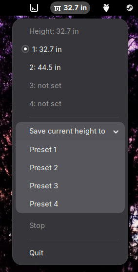

# deskstance

A Linux tray applet for standing desks with a Linak DPG Bluetooth controller,
such as the iMovR Lander.

- Shows the desk height next to the tray icon, in the unit the paddle displays.
- Lists the presets stored in the desk and marks the one the desk is at.
- Moves the desk to a preset, or saves the current height to one.

## Requirements

Debian/Ubuntu:

    sudo apt install python3-bleak python3-gi gir1.2-ayatanaappindicator3-0.1

It needs Python 3.11 and PyGObject 3.50 or newer (Debian 13, Ubuntu 25.04).

On GNOME, enable the AppIndicator extension (`ubuntu-appindicators@ubuntu.com`).
Some other tray hosts, such as KDE Plasma's, show only the icon; the height is
then at the top of the menu.

## Pairing

The paddle only accepts devices it has paired with. Press the Bluetooth button
on the paddle until its light flashes, then find the desk's address and pair:

    bluetoothctl
    > scan le
    > pair <address>
    > trust <address>

The phone app holds the desk's only connection while it is open, so close it
before starting the applet.

On connect, deskstance sets the first byte of the user ID stored in the desk
to 1; DPG1C paddles ignore movement commands from a computer otherwise. If the
Linak Desk Control app behaves differently afterward, this is the likely cause.

## Installing

    ./install.sh

This installs `deskstance` into `~/.local/bin`, adds it to the app menu, and
starts it on login. `./install.sh --uninstall` removes it.

deskstance connects to the paired Linak desk on its own. To pick a desk
explicitly, pass its address: `deskstance <address>`.

## License

MIT. deskstance is not affiliated with or endorsed by Linak or iMovR.
